# Results from the different postProcess scripts in this folder

> Please run the test cases before using the post processing scripts. 

## Table of Contents: Test Cases and Their Post-Processing Scripts

### 1. Heat Conduction
| Test Case | Post-Processing Script | Status |
|-----------|------------------------|--------|
| [1-conduction-simple.c](../testCases/1-conduction-simple.c) | [1-conduction.ipynb](1-conduction.ipynb) | [✅ Complete](#1-conduction-simple) |
| [1-conduction-simple-basilisk.c](../testCases/1-conduction-simple-basilisk.c) | [1-conduction.ipynb](1-conduction.ipynb) | [✅ Complete](#1-conduction-simple-basilisk) |
| [1-conduction-transient.c](../testCases/1-conduction-transient.c) | [1-conduction.ipynb](1-conduction.ipynb) | [✅ Complete](#1-conduction-transient) |
| [1-conduction-transient-basilisk.c](../testCases/1-conduction-transient-basilisk.c) | [1-conduction.ipynb](1-conduction.ipynb) | [✅ Complete](#1-conduction-transient-basilisk) |
| [1-conduction-transient-basilisk-withHeaders.c](../testCases/1-conduction-transient-basilisk-withHeaders.c) | [1-conduction.ipynb](1-conduction.ipynb) | [✅ Complete](#1-conduction-transient-basilisk-withheaders) |
| [1-conduction-2D.c](../testCases/1-conduction-2D.c) | [1-Video-conduction-2D.py](1-Video-conduction-2D.py) | [✅ Complete](#1-conduction-2D) |
| [1-conduction-2D-annulus.c](../testCases/1-conduction-2D-annulus.c) | [1-Video-conduction-2D-annulus.py](1-Video-conduction-2D-annulus.py) | [✅ Complete](#1-conduction-2d-annulus) |
| [1-conduction-Axi.c](../testCases/1-conduction-Axi.c) | [1-Video-conduction-Axi.py](1-Video-conduction-Axi.py) | [✅ Complete](#1-conduction-axi) |

### 2. Navier-Stokes Equations
| Test Case | Post-Processing Script | Status |
|-----------|------------------------|--------|
| [2-Poiseuille-flow-Newtonian.c](../testCases/2-Poiseuille-flow-Newtonian.c) | [2-casesWithNS.ipynb](2-casesWithNS.ipynb) | ⏳ In Progress |
| [2-Poiseuille-flow-Bingham.c](../testCases/2-Poiseuille-flow-Bingham.c) | [2-casesWithNS.ipynb](2-casesWithNS.ipynb) | ⏳ In Progress |
| [2-2D_rot_cylinder.c](../testCases/2-2D_rot_cylinder.c) | [2-casesWithNS.ipynb](2-casesWithNS.ipynb) | [✅ Complete](#2-2d_rot_cylinder) |
| [2-2D_rot_cylinder_ink.c](../testCases/2-2D_rot_cylinder_ink.c) | [2-2D_rot_cylinder_ink.py](2-2D_rot_cylinder_ink.py) | [⏳ In Progress](#2-2d_rot_cylinder_ink) |
| [2-LidDrivenCavity-Newtonian.c](../testCases/2-LidDrivenCavity-Newtonian.c) | [2-casesWithNS.ipynb](2-casesWithNS.ipynb) | [✅ Complete](#2-liddrivencavity-newtonian) |
| [2-LidDrivenCavity-Newtonian-dieInjection.c](../testCases/2-LidDrivenCavity-Newtonian-dieInjection.c) | [2-LidDrivenCavity-Newtonian-dieInjection.py](2-LidDrivenCavity-Newtonian-dieInjection.py) | [✅ Complete](#2-liddrivencavity-newtonian-dieinjection) |
| [2-LidDrivenCavity-Bingham.c](../testCases/2-LidDrivenCavity-Bingham.c) | [2-LidDrivenCavity-Bingham.ipynb](2-LidDrivenCavity-Bingham.ipynb) | [✅ Complete](#2-liddrivencavity-bingham-data) |
| [2-Rayleigh-Benard.c](../testCases/2-Rayleigh-Benard.c) | [2-Rayleigh-Benard.py](2-Rayleigh-Benard.py) | [✅ Complete](#2-rayleigh-benard) |
| [2-Rayleigh-Benard.c](../testCases/2-Rayleigh-Benard.c) | [2-Rayleigh-Benard-AMR.py](2-Rayleigh-Benard-AMR.py) | [⏳ In Progress](#2-rayleigh-benard-amr) |

### 3. Multiphase Flow
| Test Case | Post-Processing Script | Status |
|-----------|------------------------|--------|
| [3-DropImpactOnSolids.c](../testCases/3-DropImpactOnSolids.c) | [Video-generic.py](Video-generic.py) | ⏳ In Progress |
| [3-DropImpactOnPool.c](../testCases/3-DropImpactOnPool.c) | [Video-generic.py](Video-generic.py) | ⏳ In Progress |
| [3-HeatedDropImpact.c](../testCases/3-HeatedDropImpact.c) | [Video-generic.py](Video-generic.py) | ⏳ In Progress |
| [3-BurstingBubbles.c](../testCases/3-BurstingBubbles.c) | [Video-generic.py](Video-generic.py) | ⏳ In Progress |
| [3-EquilibriumOfLiquidLenses.c](../testCases/3-EquilibriumOfLiquidLenses.c) | [getFacet.c](getFacet.c) | ⏳ In Progress |

### 4. Non-Newtonian and Complex Flows
| Test Case | Post-Processing Script | Status |
|-----------|------------------------|--------|
| [4-SoftImpacts.c](../testCases/4-SoftImpacts.c) | [4-NonNewtonian.ipynb](4-NonNewtonian.ipynb) | ⏳ In Progress |
| [4-DropImpact-HB.c](../testCases/4-DropImpact-HB.c) | [4-NonNewtonian.ipynb](4-NonNewtonian.ipynb) | ⏳ In Progress |
| [4-BurstingBubbles-WithPolymers.c](../testCases/4-BurstingBubbles-WithPolymers.c) | [Video-viscoelastic.py](Video-viscoelastic.py) | ⏳ In Progress |
| [4-Taylor-Cluick-elatic.c](../testCases/4-Taylor-Cluick-elatic.c) | [getData-elastic-scalar.c](getData-elastic-scalar.c) | ⏳ In Progress |

## 1-conduction-simple
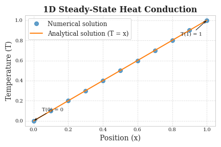

## 1-conduction-simple-basilisk
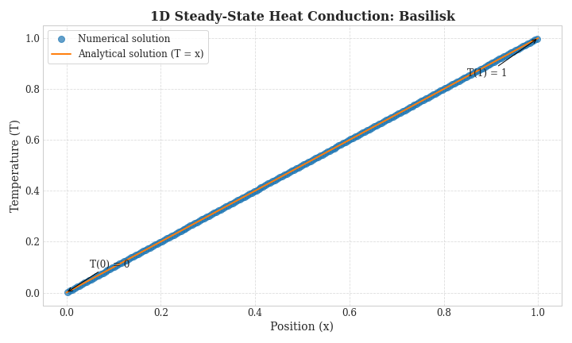

## 1-conduction-transient
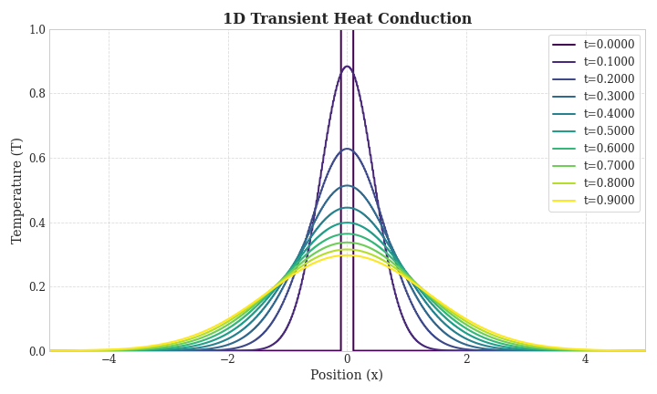
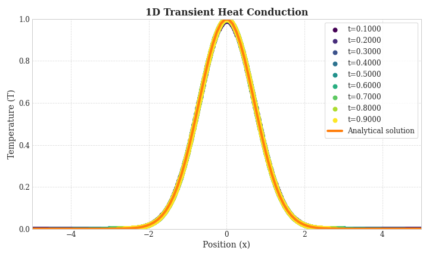

## 1-conduction-transient-basilisk
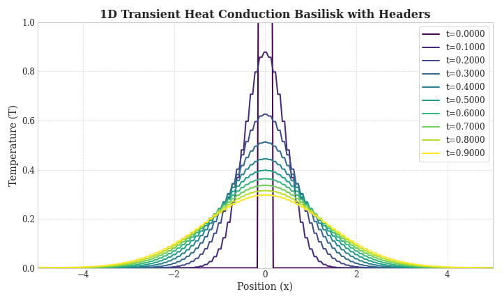
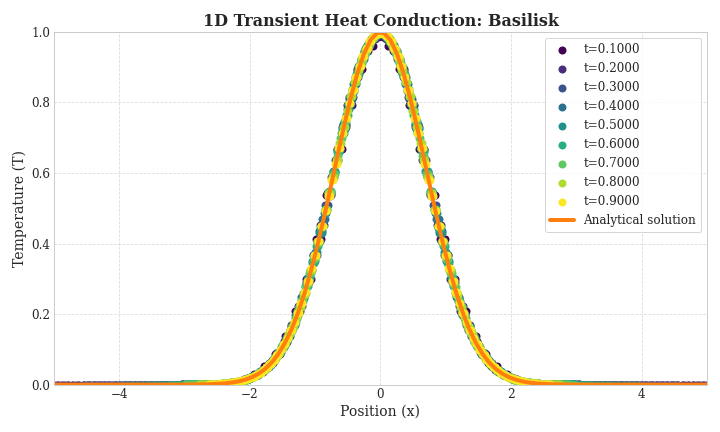

## 1-conduction-transient-basilisk-withHeaders

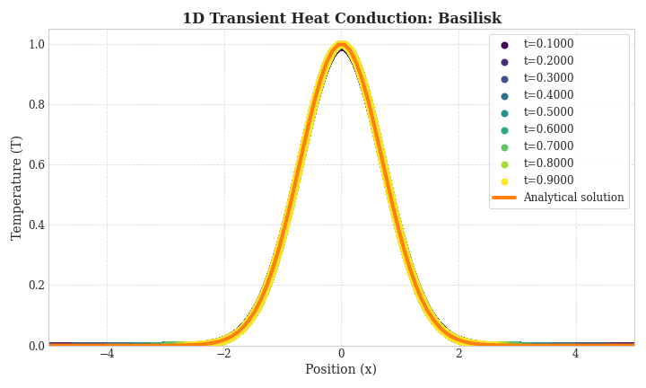

## 1-conduction-2D

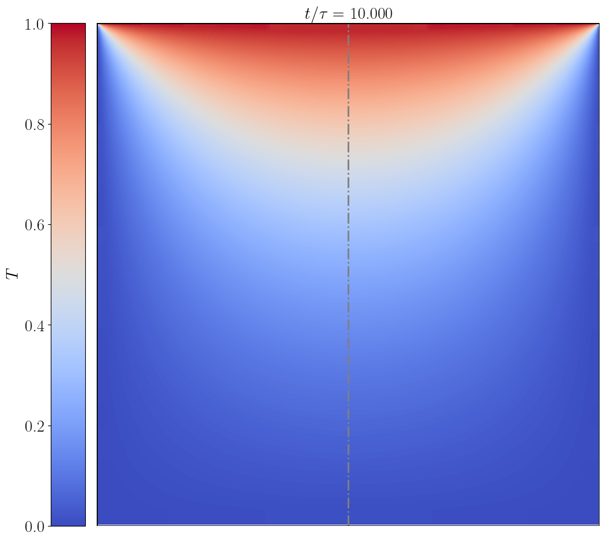

## 1-conduction-2D-annulus

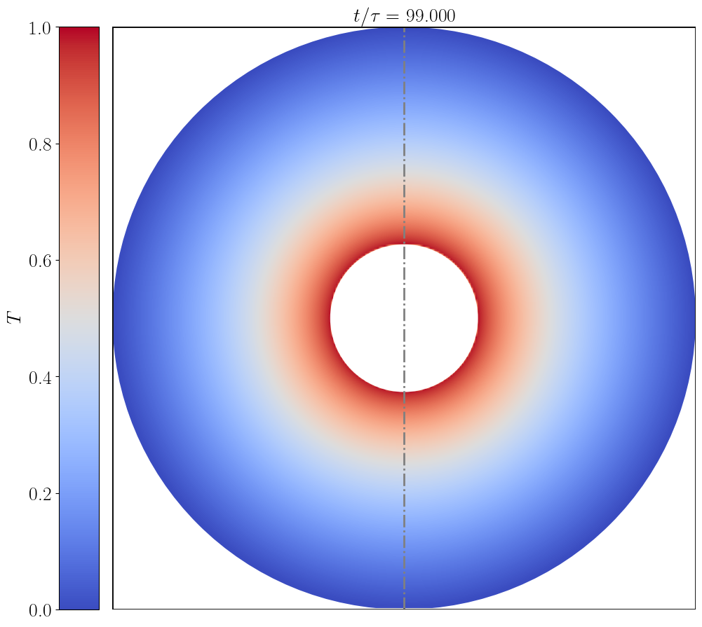

## 1-conduction-Axi

Heat flux on the top wall is modeled as a Gaussian heat flux.

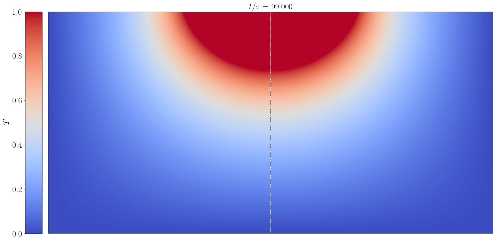

## 2-Poiseuille-flow-Newtonian
(Post-processing script in progress)

## 2-Poiseuille-flow-Bingham
(Post-processing script in progress)

## 2-2D_rot_cylinder
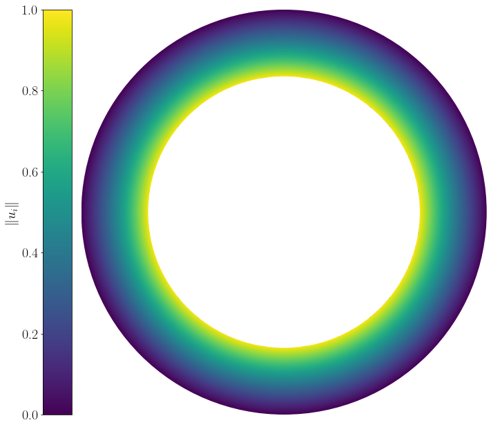

## 2-2D_rot_cylinder_ink
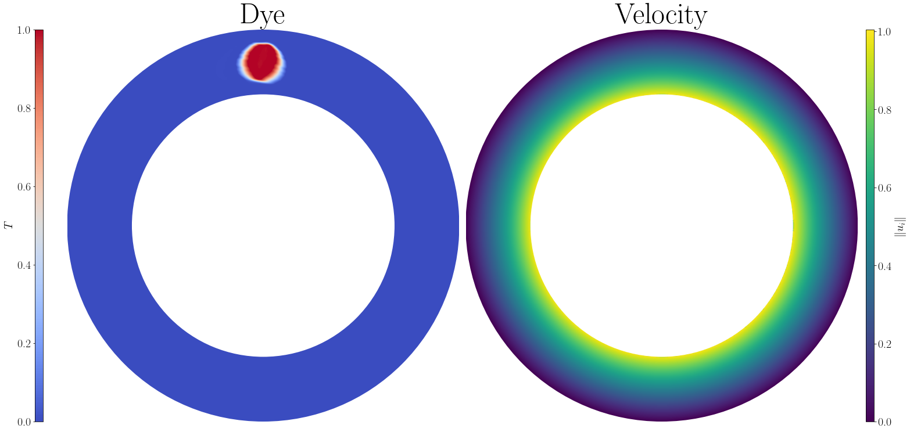

## 2-LidDrivenCavity-Newtonian
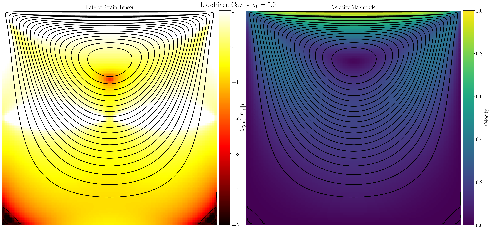
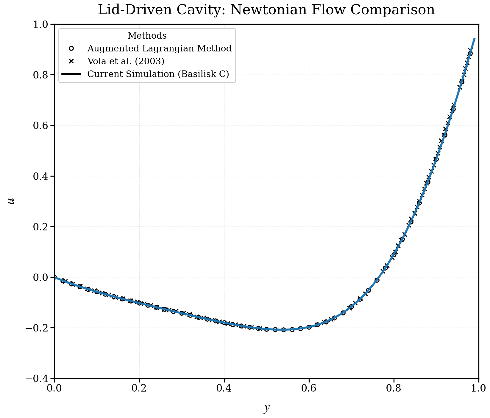

## 2-LidDrivenCavity-Newtonian-dieInjection
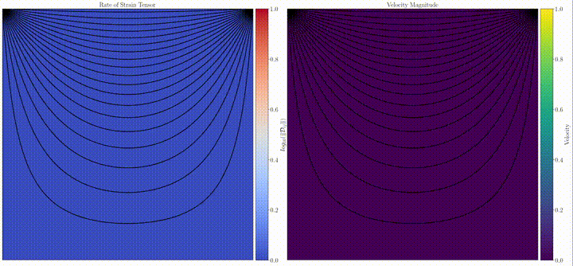

## 2-LidDrivenCavity-Bingham-Data

This is a lid driven cavity problem with a Bingham fluid.

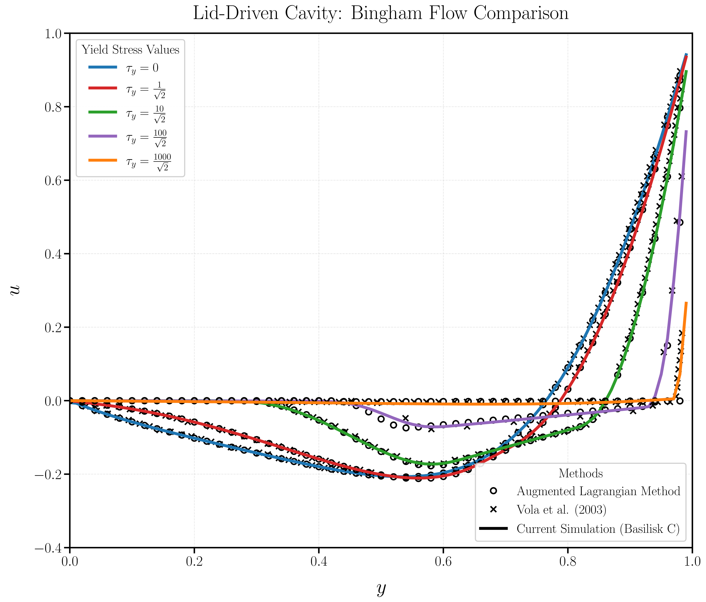

### Bingham 
- $\tau_y = 0.707$
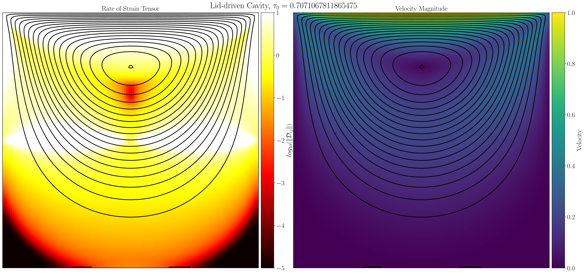
- $\tau_y = 7.07$
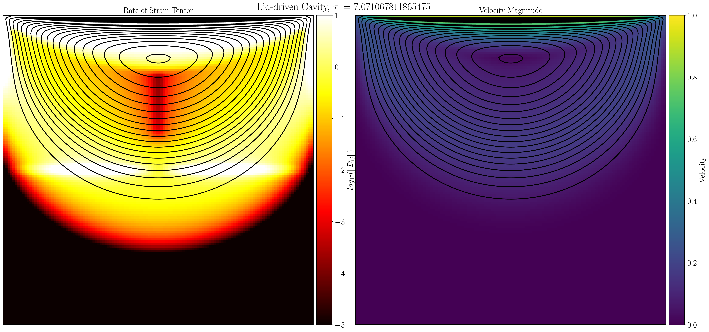
- $\tau_y = 70.7$
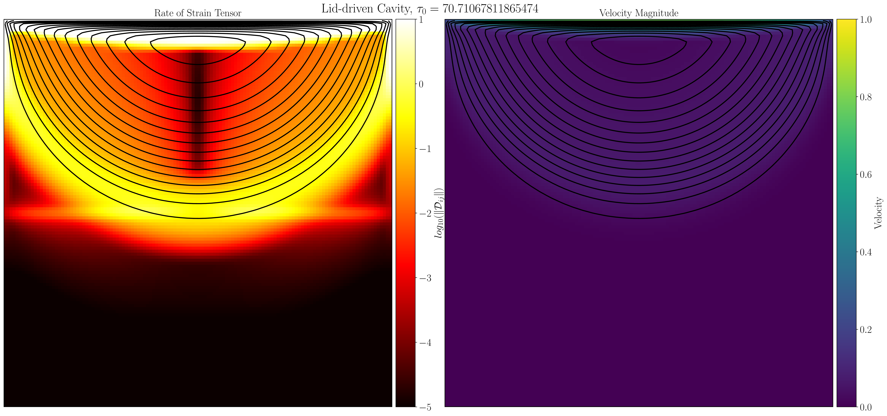
- $\tau_y = 707$
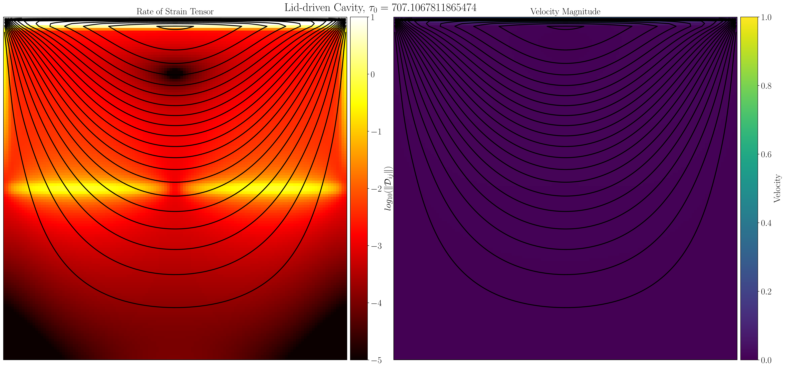

## 2-Rayleigh-Benard

## 2-Rayleigh-Benard-AMR
(Post-processing script in progress)

## 3-DropImpactOnSolids
(Post-processing script in progress)

## 3-DropImpactOnPool
(Post-processing script in progress)

## 3-HeatedDropImpact
(Post-processing script in progress)

## 3-BurstingBubbles
(Post-processing script in progress)

## 3-EquilibriumOfLiquidLenses
(Post-processing script in progress)

## 4-SoftImpacts
(Post-processing script in progress)

## 4-DropImpact-HB
(Post-processing script in progress)

## 4-BurstingBubbles-WithPolymers
(Post-processing script in progress)

## 4-Taylor-Cluick-elatic
(Post-processing script in progress)